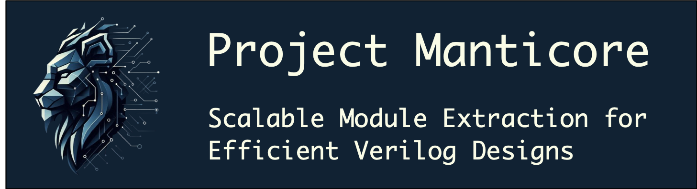

   

# Goal

The goal of this project is to conceive and implement a technique to find redundant code in Verilog designs, so that such parts can be outlined as independent modules; hence, reducing the size of the resulting design.
