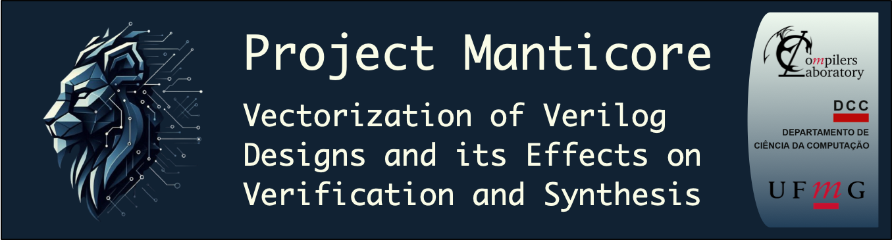

<p align="center">
  </br>
</p>

# Goal

Manticore is a compiler pass for Verilog Vectorization built on top of the [CIRCT](https://circt.llvm.org/) infrastructure.

The goal of this project is to implement a transformation that replaces multiple operations on scalar values with a single operation on vector values.

In the Verilog ecosystem, vectorization is often overlooked. Synthesis tools tend to flatten vectors into scalar wires early in the flow, as the final hardware is the same. However, for formal verification and synthesis tools, this bit-blasted representation is a major bottleneck.

Manticore runs early in the compilation pipeline to rediscover and rebuild these vectors. While this doesn't change the final hardware, it significantly reduces the symbolic complexity of the design.

This reduction is highly beneficial for downstream tools:

 - Formal Verification [Cadence® Jasper®](https://www.cadence.com/en_US/home/tools/system-design-and-verification/formal-and-static-verification.html): Platforms like Jasper® scale much better when treating a bus as a single symbolic entity, rather than as its individual bit-level wires.
 
 - Synthesis [Cadence® Genus®](https://www.cadence.com/en_US/home/tools/digital-design-and-signoff/synthesis/genus-synthesis-solution.html): Operating on entire vectors instead of individual bits can accelerate processing, particularly during the elaboration phase.

## Core Features

The Manticore pass first runs a preparatory step: **Selective Inlining**. This pass inlines small, simple sub-modules to expose vectorization opportunities that would otherwise be hidden across module boundaries. It uses heuristics based on module size and regularity to find good candidates without causing code-size explosion.

After this inlining step, Manticore implements a 3-pattern "cascade" pipeline to find vectorization opportunities. If a pattern fails, it falls back to the next one.


**1 - Bit-Level Dataflow Analysis (Pattern 1):** The fastest and most precise pass. It tracks the origin of every single bit to identify and vectorize full permutations (linear copies, bit-shuffles, and reverses).

**2 - Structural Analysis (Pattern 2):** A powerful pass that detects "parallel" logic. It uses subgraph isomorphism checks to find replicated scalar logic (like a 4-bit MUX built from 4 scalar MUXes) and safely collapse them into a single, wide vector operation .

**3 - Partial Vectorization (Pattern 3):** A "best-effort" fallback pass. If the full vector can't be vectorized (e.g., out[0] has different logic), this pass finds and vectorizes the largest possible "chunks" (like out[3:1]) and concatenates them with the remaining scalar bits .

## What Manticore Does: A Quick Example

Manticore analyzes scalar (bit-blasted) Verilog and automatically rebuilds vector operations where possible.

For example:

`test.v` (Before):
```Verilog
module simple_vectorization(output wire[3:0]out,input wire[3:0]in);
 assign out[3]=in[3];
 assign out[2]=in[2];
 assign out[1]=in[1];
 assign out[0]=in[0];
endmodule
```

`test_final.v` (After):
```Verilog
module simple_vectorization(output wire[3:0]out,input wire[3:0]in);
 assign out=in;
endmodule
```

## Dependencies
To build and run Manticore, you will need:

* **[LLVM](https://github.com/llvm/llvm-project) / [CIRCT](https://github.com/llvm/circt):** Manticore is built as a pass for CIRCT. You must have a working local build of CIRCT and its LLVM/MLIR dependencies.
  * Please follow the official CIRCT "Getting Started" guide to install and build CIRCT: https://circt.llvm.org/docs/GettingStarted/

* **C++ Compiler:** A modern C++ compiler (e.g., `clang++` or `g++`).

* **Make:** To build the project.

## Manticore Tutorial

### Installing

1. Clone Manticore
```Bash
git clone https://github.com/lac-dcc/manticore.git

cd manticore
```

2. You may need to update the CIRCT/LLVM paths in the Makefile
```Bash
make
```
This will create the shared library plugin at `src/passes/hw-vectorization/VectorizePass.so`. 

### Run the Pipeline

The repository includes a script `run_vec.sh` that automates the entire vectorization pipeline.

Create your **Verilog input file** and save it as `test.v`  in the `src/passes/hw-vectorization/` directory.

Make the script executable (if needed): `chmod +x run_vec.sh`

Run the script:
```Bash
cd src/passes/hw-vectorization

./run_vec.sh
```

The script will automatically perform all the necessary steps:


**1. Verilog to MLIR:** Converts `test.v` to `test.hw.mlir`.

**2. Run Manticore:** Runs the hw-vectorization pass on the MLIR file.

**3. Cleanup:** Runs standard `circt-opt` cleanup passes.

**4. Generate Verilog:** Converts the optimized MLIR back to Verilog.

**5.** The final vectorized output will be available at `test_final.v`.

## Upstream Contributions to CIRCT
A major goal of this project is to contribute these optimizations back to the main [CIRCT](https://github.com/llvm/circt) framework.

* **`comb.reverse` Operation:** As part of this work, our first contribution was adding the `comb.reverse` operation to the CIRCT comb dialect . This was necessary to efficiently represent the "reverse" (Pattern 1) vectorization. You can check it [here](https://github.com/llvm/circt/pull/8758).

* **Vectorization Pass:** A Pull Request to upstream the full Manticore vectorization pass is currently in development. You can check it [here](https://github.com/llvm/circt/pull/9222).

## License
This project is sponsored by **Cadence Design Systems**. 

Manticore is maintained by the [Compilers Laboratory](https://lac-dcc.github.io/) at the **Federal University of Minas Gerais (UFMG), Brazil**.

This project is licensed under the GPL-3.0 License.